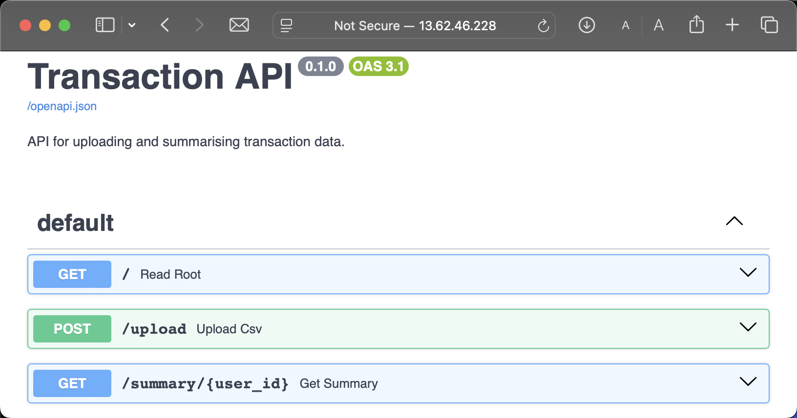

## Transaction Analysis API 

This project is a decoupled RESTful API and ETL service built with Python, FastAPI, Prefect, and PostgreSQL. It is fully containerised using Docker and deployed to AWS (EC2 & RDS) with a fully automated CI/CD pipeline via GitHub Actions. 

The architecture separates the web server from heavy data processing. It provides API endpoints for users to upload massive CSV files and retrieve summarised statistics, while background worker containers handle data chunking, automated nightly data generation, and idempotent database insertions. 

---

### Features

* **Decoupled Data Orchestration:** Uses Prefect to offload heavy CSV processing. 
* **Automated Cron Jobs:** A scheduled nightly pipeline to automatically generate, processe, and append yesterday's simulated transactions to the database.

* **Cloud Deployment:** Hosted on AWS EC2 with a managed AWS RDS PostgreSQL database.
* **Continuous Deployment (CI/CD):** Fully automated pipeline via GitHub Actions. Pushing to main triggers automated testing (Pytest), Docker image builds to GitHub Container Registry, and zero-downtime deployment to the EC2 server via SSH.

---

### Tech Stack
* **Backend:** Python 3.11, FastAPI, Pandas, Pytest
* **Data Orchestration:** Prefect, SQLAlchemy, Alembic
* **Infrastructure:** Docker, Docker Compose, AWS EC2 (Amazon Linux), AWS RDS (PostgreSQL 15)
* **DevOps:** GitHub Actions (CI/CD), GitHub Container Registry (ghcr.io)

---

*Note: The live AWS EC2 and RDS instances may be down to conserve AWS Free Tier limits.*
*... Try `http://13.62.46.228/docs#/`*




### Running Locally 

**1. Clone the Repository:**
```sh
git clone https://github.com/dan-k-k/transactionapi
cd transactionapi
```
**2. Start the Application:**

```Bash
docker compose up
# wait for automatic tests to pass and open http://localhost:8000/docs
```
**3. Explore the Dashboards:**

* **FastAPI Swagger UI:** Navigate to http://localhost:8000/docs
* **Prefect Dashboard:** Navigate to http://localhost:4200 to view the active data pipelines and scheduled runs.

### Running the Application Locally

Navigate to http://localhost:8000/docs

**1. Background Upload**
  1. Click on the POST /upload endpoint. "Try it out".
  2. Upload a sample CSV. You can generate transactions with `python -m app.gen_bulk`.
  3. Check the Prefect Dashboard (http://localhost:4200) to watch the CSV Ingestion Pipeline worker in real time.

**2. Get User Summary**
  1. Click on the GET /summary/{user_id} endpoint. Click "Try it out".
  2. Enter a user_id eg. '1' and a date range in the format YYYY-MM-DD.
  3. Click Execute to see the aggregated max, min, and mean statistics.

### Developing Locally

1. Create a file named `docker-compose.override.yml` in the root directory:

```YAML
services:
  web:
    build: .
  worker:
    build: .
```

2. Run `docker compose up --build`. The app will now reflect your local changes. 

