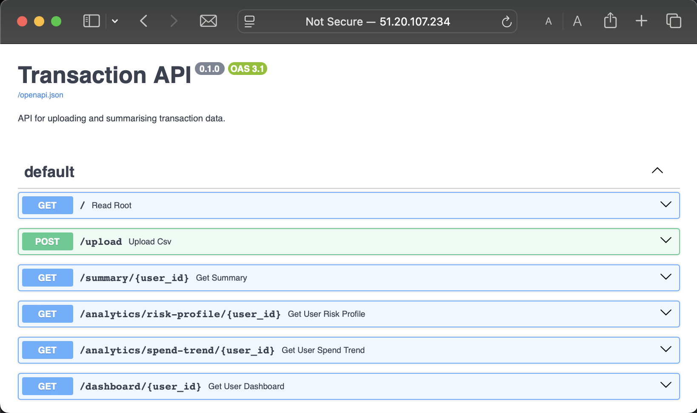
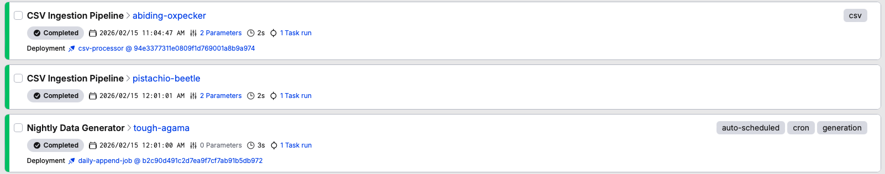
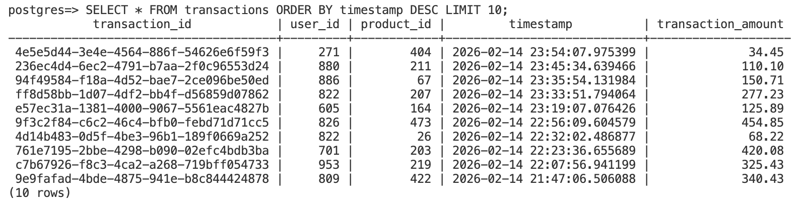
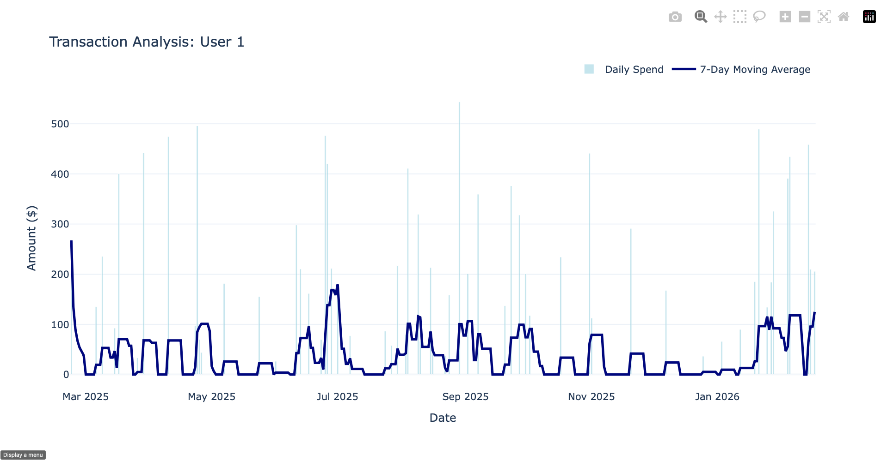

## Transaction Analysis API 

A decoupled RESTful API and ETL pipeline that ingests, processes, and analyzes large volumes of simulated transaction data.

---

### Tech Stack
* **Backend:** Python 3.11, FastAPI, Pandas, Pytest
* **Database & Analytics:** PostgreSQL 15, SQLAlchemy, Alembic (Advanced SQL, CTEs, Window Functions)
* **Orchestration:** Prefect (Background workers, scheduled nightly cron jobs)
* **Infrastructure (IaC):** Terraform, AWS EC2 (Ubuntu), AWS RDS
* **CI/CD & DevOps:** GitHub Actions, Docker, Docker Compose, Ruff, Bandit

---

*Note: The live AWS EC2 and RDS instances may be down to conserve AWS Free Tier limits.*
*... Try `http://51.20.107.234/docs`*










### Running Locally

**Clone the Repository:**
```sh
git clone https://github.com/dan-k-k/transactionapi
cd transactionapi
docker compose up
# wait for automatic tests to pass and open http://localhost:8000/docs
```
**Explore the Dashboards:**

* **FastAPI Swagger UI:** Navigate to http://localhost:8000/docs
* **Prefect Dashboard:** Navigate to http://localhost:4200 to view the active data pipelines and scheduled runs.

### API Endpoints & Usage

Navigate to http://localhost:8000/docs

* `POST /upload` - Upload custom CSVs for ingestion. *(Alternatively, use the Prefect Dashboard -> Deployments -> Bulk Data Generator to simulate data).*

* `GET /summary/{user_id}` - Retrieve aggregated max, min, and mean spending statistics for a specific date range.

* `GET /analytics/risk-profile/{user_id}` - Calculates a user's global ranking, spending volatility, and transaction velocity.

* `GET /dashboard/{user_id}` - Renders an interactive Plotly dashboard displaying daily spend and a 7-day moving average. *(Access this directly in your browser, not Swagger).*

### Developing Locally

1. Create a file named `docker-compose.override.yml` in the root directory:

```YAML
services:
  web:
    build: .
  worker:
    build: .
```

2. Run `docker compose up --build`. The app will now reflect your local changes. 

